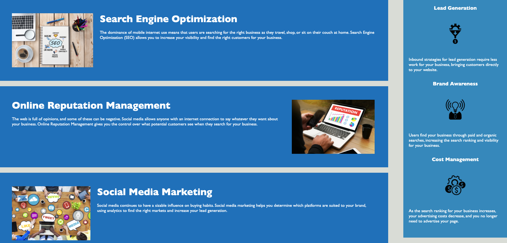

# code-refactor

Code-Refactor is a project that helped to improve the existing website, so it will meet accessibility standards. That will help the website have a better position in search engines (like Google). It also helps companies avoid litigation that can occur when people with disabilities cannot access their website.

On this screenshot you can see top of website with navigation bar that hepls you easy access to the part of page you want to see.

On second screenshot you can see the body of site with a different articles.

Link to deployed application https://slugovoy.github.io/code-refactor/